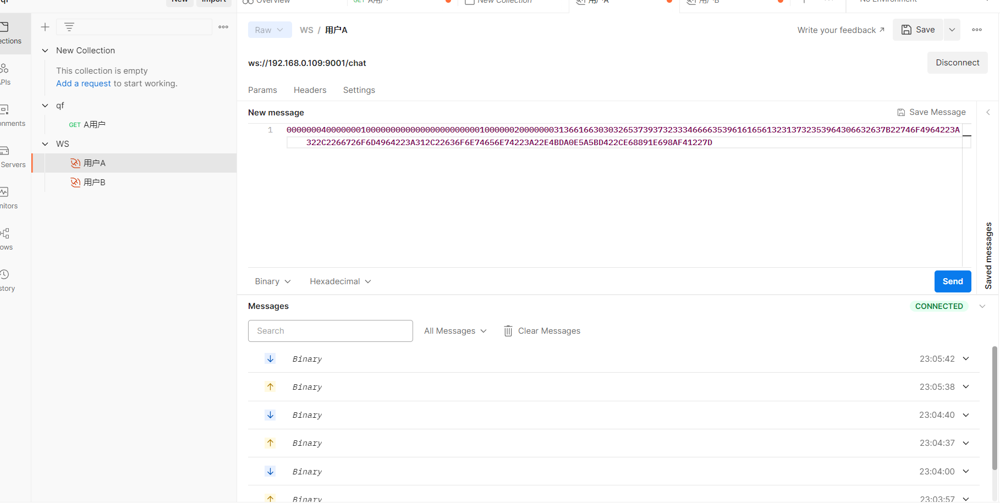
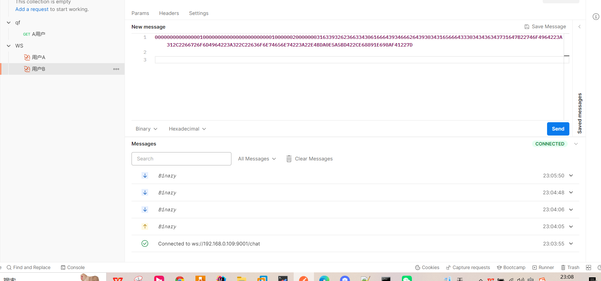
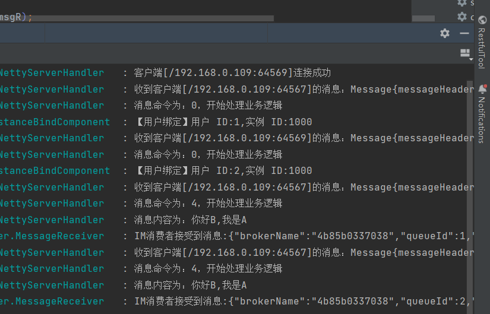

# QF-IM-CHAT 💬
**强的飞起** - 基于现代技术栈构建的高性能、可扩展的IM通讯

[]()  
[]()  
[]()  
[]()  

## 技术栈

| 技术组件 | 版本 | 用途说明 |
|---------|------|----------|
| **JDK 17** | 17+ | 利用最新LTS版本的性能优势和语言特性，Records、Pattern Matching等 |
| **Spring Boot** | 3.x | 现代化应用框架，快速开发企业级应用 |
| **Nacos** | 2.x | 服务注册发现、配置管理、服务治理 |
| **RocketMQ** | 5.0 | 高吞吐消息队列，保障消息可靠投递和顺序性 |
| **Redis** | 7.0 | 缓存、会话管理、在线状态、发布订阅 |
| **Netty** | 4.x | 高性能网络通信框架，支撑百万级并发连接 |

## 项目结构
| 模块            | 功能说明    |
|---------------|---------|
| **im-common** | 公共服务    |
| **im-biz**    | 业务服务    |
| **im-server** | netty服务 |
| **im-task**   | 定时任务服务  |

## 高性能

自定义二进制websocket协议

## 可靠性


## 有序性

消息中间件保证有序性

## 项目配置
* common.yml
```yaml
spring:
  redis:
    redisson:
      config: |
        singleServerConfig:
          address: redis://192.168.0.107:6379
          timeout: 3000

rocketmq:
  name-server: 192.168.0.107:9876
```
* im-server.yml
```yaml
server:
  port: 8081

netty:
  server:
    tcp-port: 9001
    boss-thread-size: 1
    work-thread-size: 4
    heart-beat-time: 30000
    broker-id: 1000
```  
* im-biz.yml
```yaml
server:
  port: 8082
``` 
## 发消息测试
* 用户A

* 用户B

* 控制台

